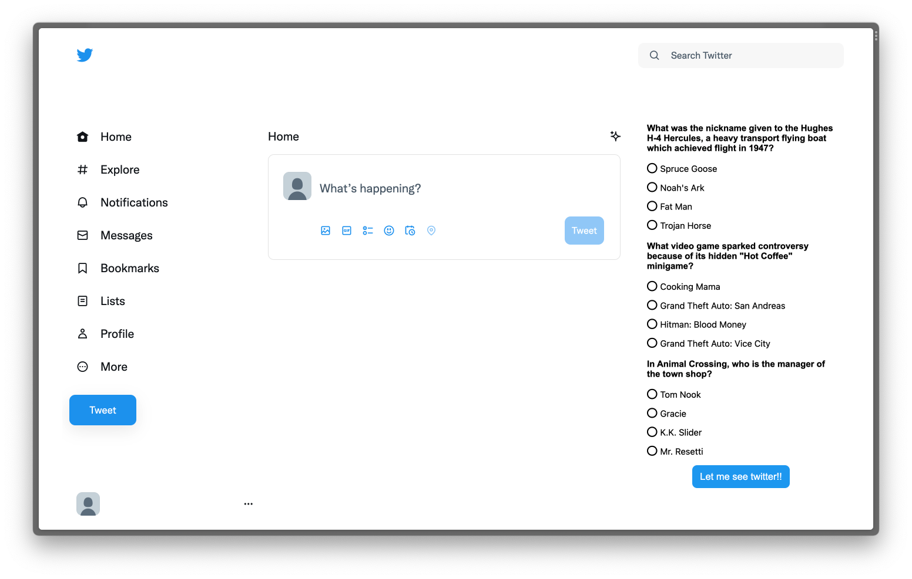

# trivia-to-twitter

I don't know if its the World Cup®, all that twitter drama, the memes or if I'm just really addicted now, but I am checking twitter _constantly_. 
But, twitter does have some value to offer, so I can't just lock it down and be done. I had to find a way to at least learn something from all that scrolling. 

Introducing...

Trivia to Twitter

Before being able to see your timeline, you will need to answer a short trivia and have 66.6666% of the answers correct. 

Too easy? Having too much fun?

You can edit the code to change the number or difficulty of the questions at any time. 

Happy Trivia and Happy Tweeting!

